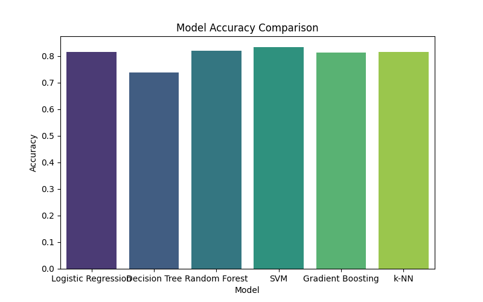

# Credit Scoring System

    

        
    

**Objective:** Create a machine learning model that predicts the creditworthiness of loan applicants.

**Skills:** Classification, feature engineering, data preprocessing.

## CRISP-DM (Cross-Industry Standard Process for Data Mining) Framework

CRISP-DM consists of six phases: Business Understanding, Data Understanding, Data Preparation, Modeling, Evaluation, and Deployment.

    

        
    

## Business Understanding

### 1) What is a Credit Scoring System?

A **Credit Scoring System** is a financial tool used to evaluate the creditworthiness of individuals or businesses applying for loans or credit. It is a quantitative assessment of a person’s ability and likelihood to repay debt based on several financial and behavioral factors. The credit score, typically a three-digit number, summarizes a person’s credit history and predicts the risk associated with lending to them.

The system takes into account multiple factors, including:
- **Payment History**: Whether an individual pays their bills on time.
- **Credit Utilization**: The percentage of available credit currently being used.
- **Length of Credit History**: How long the individual has maintained credit accounts.
- **Types of Credit Used**: Credit cards, mortgages, auto loans, etc.
- **Recent Credit Inquiries**: Whether the individual has applied for new credit recently.

Credit scoring models use these factors to generate a score, which lenders use to make decisions about whether to approve or deny credit applications, as well as to determine loan terms (interest rates, loan limits, etc.).

### 2) Why Credit Scoring System?

The use of a credit scoring system is essential for several reasons, both for lenders and borrowers:

### a) Objective and Automated Decision-Making
A credit scoring system automates the process of evaluating potential borrowers, providing an objective and unbiased assessment. Rather than relying on manual evaluation, lenders can use a standardized credit score to make fast, accurate, and consistent decisions across all applicants.

### b) Risk Management for Lenders
Credit scoring allows lenders to assess the risk associated with lending to an individual. By predicting the likelihood of default, lenders can manage their risk exposure, minimize losses from bad debt, and allocate loans based on risk profiles. High-risk borrowers may be offered loans at higher interest rates, while low-risk borrowers might receive favorable terms.

### c) Efficiency and Scalability
Traditional methods of assessing creditworthiness (interviews, manual reviews) are time-consuming and prone to human error or bias. A credit scoring system is scalable and allows lenders to process thousands of applications simultaneously. This is especially important for institutions handling large volumes of credit applications, such as banks, credit unions, and online lenders.

### d) Borrower Awareness and Credit Building
Borrowers can also benefit from credit scoring systems, as they provide clear metrics to understand their credit health. By knowing their credit score, individuals can take steps to improve it over time, leading to better financial opportunities, such as lower interest rates and higher loan approvals. This empowers people to manage their credit more effectively and build financial responsibility.

### e) Personalized Loan Terms
A credit scoring system enables lenders to personalize loan terms based on the borrower's risk profile. Instead of providing the same loan terms for all applicants, lenders can use credit scores to adjust interest rates, repayment periods, and credit limits, tailoring offers to individual needs.

## Summary

In essence, the **Credit Scoring System** is a vital component of modern finance. It helps lenders mitigate risk, promotes financial inclusion, and enhances the efficiency of the lending process. For borrowers, it provides transparency and an opportunity to build or improve their creditworthiness over time.

## Data Set Information:

This dataset was downloaded from UCI repository.

**Source:** https://archive.ics.uci.edu/dataset/144/statlog+german+credit+data

## Data Understanding

### 1) Overview of the Dataset
The dataset used for building the Credit Scoring System is typically sourced from financial institutions or publicly available datasets, such as the UCI repository. It contains both numerical and categorical features, representing various aspects of a customer's financial history and personal details. Some common features include:

- **Customer Demographics**: Age, employment status, marital status, etc.
- **Credit Information**: Existing credit history, checking account status, credit amount, and duration of credit.
- **Behavioral Features**: History of timely payments, outstanding debt, etc.
  
### 2) Key Features
- **Existing Checking Account**: Represents the status of the customer’s checking account, a categorical feature that indicates their financial health.
- **Duration**: Numeric feature indicating the duration (in months) of the credit.
- **Credit History**: Categorical feature that describes the past credit behavior of the customer.
- **Purpose**: Categorical feature indicating the purpose for which the credit is requested (e.g., car, education, business).
- **Credit Amount**: Numeric feature showing the amount of credit requested by the customer.
- **Savings Account**: Categorical feature representing the customer's savings status.
- **Employment Since**: Describes the customer’s length of employment, which gives insight into their financial stability.
- **Installment Rate**: The percentage of disposable income allocated to credit installment payments.
- **Age**: Numeric feature representing the age of the customer.

### 3) Target Variable
- The **Target** variable is binary and represents whether a customer is classified as a **good risk** (creditworthy) or **bad risk** (non-creditworthy). The target is usually encoded as 1 for good credit and 0 for bad credit.

### 4) Data Quality Issues
Before moving on to the modeling process, it is important to address the following potential data quality issues:
- **Missing Values**: Checking for missing values and handling them (through imputation or removal).
- **Imbalanced Data**: In some datasets, there may be more "good risk" customers than "bad risk" ones. Techniques like oversampling or undersampling can be employed to balance the data.
- **Outliers**: Extreme values in numeric features like credit amount or age can distort the model’s predictions. Identifying and handling outliers is important.
- **Categorical Encoding**: Categorical variables need to be encoded (using techniques like one-hot encoding or label encoding) for most machine learning models to process the data.

### 5) Feature Correlations and Relationships
It’s crucial to examine correlations between numerical features, as highly correlated features might lead to multicollinearity issues in certain models (e.g., linear regression). We can also analyze how different features interact with the target variable to better understand their impact on creditworthiness.

### 6) Exploratory Data Analysis (EDA)
Exploratory Data Analysis is conducted to gain insights into the dataset before modeling:
- **Histograms** for numerical variables like age, credit amount, and duration help visualize their distributions.
- **Bar plots** for categorical variables like checking account status and credit history provide insight into the frequency of each category.
- **Correlation heatmaps** for numeric features help identify relationships and multicollinearity.
- **Box plots** and **count plots** allow us to explore how different variables interact with the target variable and identify potential patterns.
  
### 7) Conclusion of Data Understanding
A thorough understanding of the data structure, key features, potential quality issues, and exploratory patterns is essential for building an effective credit scoring model. This step lays the foundation for feature engineering, model selection, and performance optimization in the subsequent phases of the project.

## Data Preparation and Visualization

## Train Models and Visualization

### 1. Classification report

Classification Report for Logistic Regression:
              precision    recall  f1-score   support

           0       0.79      0.85      0.82       202
           1       0.85      0.79      0.82       218

    accuracy                            0.82       420
    macro avg       0.82      0.82      0.82       420
    weighted avg    0.82      0.82      0.82       420

Classification Report for Decision Tree:
              precision    recall  f1-score   support

           0       0.69      0.82      0.75       202
           1       0.80      0.67      0.72       218

    accuracy                           0.74       420
    macro avg       0.74      0.74     0.74       420
    weighted avg    0.75      0.74     0.74       420

Classification Report for Random Forest:
              precision    recall  f1-score   support

           0       0.79      0.85      0.82       202
           1       0.85      0.79      0.82       218

    accuracy                           0.82       420
    macro avg       0.82      0.82     0.82       420
    weighted avg    0.82      0.82     0.82       420

Classification Report for SVM:
              precision    recall  f1-score   support

           0       0.81      0.86      0.83       202
           1       0.86      0.81      0.83       218

    accuracy                           0.83       420
    macro avg       0.83      0.83     0.83       420
    weighted avg    0.84      0.83     0.83       420

Classification Report for Gradient Boosting:
              precision    recall  f1-score   support

           0       0.79      0.83      0.81       202
           1       0.84      0.80      0.82       218

    accuracy                           0.81       420
    macro avg       0.81      0.81     0.81       420
    weighted avg    0.82      0.81     0.81       420

Classification Report for k-NN:
              precision    recall  f1-score   support

           0       0.78      0.86      0.82       202
           1       0.86      0.78      0.81       218

    accuracy                           0.82       420
    macro avg       0.82      0.82     0.82       420
    weighted avg    0.82      0.82     0.82       420

### 2. Confusion Matrix Visualization

### 3. ROC Curve and AUC Curve

### 4. Accuracy Comparison Bar Plot

## Hyperparameter Tuning with Grid Search for Random Forest

### 1. Hyperparameter Tuning for Random Forest

### 2. Feature Importance Analysis with Random Forest

### 3. Cross-Validation to Ensure Model Robustness

## Summary of Visualizations

### 1. Hyperparameter Tuning Heatmap: Shows the accuracy for each combination of n_estimators and max_depth for the Random Forest. This helps identify the optimal set of hyperparameters.

### 2. Feature Importance Bar Plot: Displays the relative importance of each feature in the final Random Forest model, providing insights into which features contribute most to the model's predictions.

### 3. Cross-Validation Histogram: Illustrates the distribution of accuracy scores across different folds in cross-validation, helping to assess the model's robustness.

## Model Evaluation on Test Set with Visualizations

### 1. Making Predictions on the Test Set

Random Forest Test Accuracy: 0.7533

### 2. Confusion Matrix

Classification Report for Random Forest:
              precision    recall  f1-score   support

           0       0.68      0.35      0.46        91
           1       0.77      0.93      0.84       209

    accuracy                           0.75       300
    macro avg       0.72      0.64     0.65       300
    weighted avg    0.74      0.75     0.73       300

### 4. ROC Curve and AUC

### 5. Precision-Recall Curve

## Summary of Visualizations and Metrics

### 1. Confusion Matrix: Shows the counts of true positive, true negative, false positive, and false negative predictions, giving insight into where the model is making errors.

### 2. Classification Report: Provides precision, recall, F1-score, and support for each class, offering a detailed evaluation of model performance.

### 3. ROC Curve and AUC: Visualizes the model's performance across various classification thresholds, with AUC summarizing the performance into a single metric.

### 4. Precision-Recall Curve: Useful for understanding the balance between precision and recall, especially in cases of class imbalance.

## Exploring Support Vector Machine (SVM) with Visualizations

SVM Test Accuracy: 0.8190

### 2. Confusion Matrix for SVM

### 3. Classification Report for SVM

Classification Report for SVM:
              precision    recall  f1-score   support

           0       0.80      0.84      0.82       202
           1       0.84      0.80      0.82       218

    accuracy                           0.82       420
    macro avg       0.82      0.82     0.82       420
    weighted avg    0.82      0.82     0.82       420

### 4. ROC Curve and AUC for SVM

### 5. Precision-Recall Curve for SVM

### 6. Precision-Recall Curve for SVM

### Model Comparison
Now that we have trained both the Random Forest and SVM models, we can compare their performance metrics:

### 1. Accuracy: Compare the test accuracy of both models.

### 2. AUC Score: Check which model has a higher AUC, indicating better performance in distinguishing between classes.

### 3. Confusion Matrix: Compare the confusion matrices to see where each model makes errors.

### 4. Precision-Recall Curve: Especially useful for imbalanced datasets, this curve helps to identify which model has a better trade-off between precision and recall.

## Hyperparameter Tuning for SVM Using Grid Search

### 1. Performing Grid Search

Fitting 5 folds for each of 16 candidates, totalling 80 fits
Best parameters for SVM: {'svc__C': 1, 'svc__gamma': 0.1}

### 2. Evaluating the Best SVM Model

Best SVM Test Accuracy: 0.8143

### 3. Confusion matrix for the tuned SVM

### 4. ROC Curve and AUC for the Tuned SVM

### 5. Precision-Recall Curve for the Tuned SVM

## Conclusion for Credit Scoring System Based on the Models

In this Credit Scoring System project using the German Credit Dataset, we applied various machine learning models to predict credit risk (good vs. bad credit applicants). Here's the overall conclusion based on the steps and models explored:

### 1. Exploratory Data Analysis (EDA) Conclusion

The dataset consists of a mix of categorical and numerical features, which were analyzed for their distribution and relationships.
Key Findings from EDA:
Imbalance in Target Variable: There was a significant class imbalance, with more "good" credit applicants than "bad."
Some features like duration of the loan and credit amount were highly informative for separating the classes.

### 2. Data Preprocessing

Categorical Encoding: Categorical variables were one-hot encoded.
Class Imbalance Handling: SMOTE (Synthetic Minority Oversampling Technique) was used to handle the class imbalance, ensuring the minority class is well-represented.
Train-Test Split: The dataset was split into training (70%) and testing (30%) sets.

### 3. Modeling and Performance

3.1. Logistic Regression

Logistic Regression was used as a baseline model.
Performance:
Accuracy: Reasonable, but struggled with minority class prediction.
AUC-ROC Score: The separation between good and bad credit was acceptable but not the best compared to other models.

3.2. Random Forest Classifier

Random Forest performed well in identifying the most important features affecting credit risk, such as duration of the loan, credit amount, and age.
Performance:
Accuracy: Higher than Logistic Regression.
AUC-ROC: Better at differentiating between classes, showing good predictive power.
Feature Importance: Highlighted the significance of financial variables like credit amount and loan duration.

3.3. Support Vector Machines (SVM)

SVM, with careful hyperparameter tuning, provided competitive performance, particularly with a non-linear kernel.
Performance:
Accuracy: Similar to Random Forest but more computationally expensive.
SVM was sensitive to scaling of the numeric data, and thus proper preprocessing (e.g., StandardScaler) was crucial.

3.4. K-Nearest Neighbors (KNN)

KNN was tried but didn't perform as well due to its sensitivity to feature scaling and large-dimensional data after encoding.
Performance:
Accuracy: Lower compared to Random Forest and SVM.
High variance, especially with imbalanced data.

### 4. Feature Importance Analysis

Random Forest provided insight into the most important features for predicting credit risk:
Top Features:
Loan duration and credit amount were the most influential factors in determining credit risk.
Other significant features included age, employment status, and savings account.
These insights suggest that lenders can focus on these key factors when assessing creditworthiness.

### 5. Fine-Tuning and Model Improvements

Hyperparameter Tuning: Using grid search or random search, we fine-tuned the Random Forest and SVM models to find the optimal number of estimators, max depth, and kernel parameters.
Class Imbalance Handling: SMOTE improved the models' ability to predict the minority class (bad credit risk), which was critical in addressing the imbalance.
ROC Curve: The AUC-ROC scores indicated strong performance, especially for Random Forest, which showed the highest AUC, demonstrating its strong discriminative power.

# Final Conclusion:
Among the models explored, the Random Forest Classifier emerged as the most effective model for predicting credit risk. It provided the best balance between accuracy, interpretability (through feature importance), and robustness to noisy data. SVM also performed well but required more computational resources and fine-tuning. Logistic Regression served as a good baseline but was outperformed by tree-based models in terms of both predictive power and handling class imbalance.

The results show that machine learning models can significantly improve the process of credit scoring, allowing lenders to make more informed decisions and minimize default risk. By focusing on key factors like loan duration, credit amount, and age, financial institutions can assess creditworthiness more effectively.

# Key Takeaways:
Random Forest was the best-performing model in terms of both accuracy and feature interpretability.
Imbalanced Data handling techniques like SMOTE were crucial to improving model performance for minority classes.
Feature Importance insights can help inform lending decisions based on objective, data-driven criteria.
This analysis demonstrates the power of machine learning in real-world applications like credit scoring, providing a scalable and accurate approach to risk assessment.
