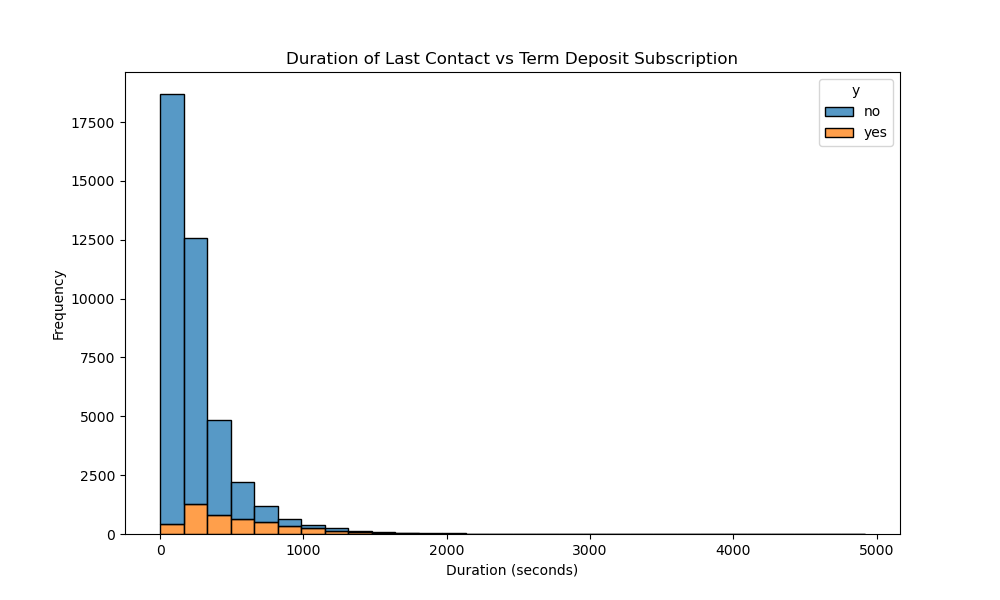

# Bank Marketing Campaigns research

This project involves building and evaluating machine learning models using the Bank Marketing dataset. The goal is to predict whether a client will subscribe to a term deposit based on a variety of features.

## Dataset

The dataset used is the **Bank Marketing** dataset, which contains information on various attributes such as age, job, marital status, education, default status, balance, housing loan, personal loan, and more.

- **Source**: [UCI Machine Learning Repository - Bank Marketing Dataset](https://archive.ics.uci.edu/ml/datasets/Bank+Marketing)

## Project Structure

The project is organized into the following sections:

1. **Data Loading and Exploration**:
    - Load the dataset and explore its structure and contents.
      
  		Client Information:
   
		age: Age of the client
		job: Job type (categorical)
		marital: Marital status (categorical)
		education: Education level (categorical)
		default: Has credit in default? (categorical)
		housing: Has housing loan? (categorical)
		loan: Has personal loan? (categorical)
	
 		Contact:

		contact: Communication type (categorical)
		month: Last contact month (categorical)
		day_of_week: Last contact day of the week (categorical)
		duration: Last contact duration in seconds (numeric)
	
 		Campaign Information:

		campaign: Number of contacts performed during this campaign (numeric)
		pdays: Number of days since the client was last contacted (numeric)
		previous: Number of contacts before this campaign (numeric)
		poutcome: Outcome of the previous campaign (categorical)

		Other variables:

		emp.var.rate: Employment variation rate (numeric)
		cons.price.idx: Consumer price index (numeric)
		cons.conf.idx: Consumer confidence index (numeric)
		euribor3m: Euribor 3 month rate (numeric)
		nr.employed: Number of employees (numeric)

		Target Variable:

		y: Subscription to a term deposit (binary: 'yes' or 'no')

  
  
  
  
  
  
  
  
  
  
  
  
  
- Identify and handle any missing values.
  * No missing values
- Encode categorical variables.
  * Categorical columns were encoded using Preprocessing Labelencoder.

2. **Feature Engineering**:
    - Transform and select features for model training.
    - Split the data into training and testing sets.

3. **Baseline Model**:
    - Implement a baseline model using `DummyClassifier` with the strategy `"most_frequent"`.
    - Evaluate the baseline model using various metrics like accuracy, precision, recall, and F1 score.

      

4. **Simple Model**:
    - Implement a simple model using Linear Regression
    - Evaluate the simple model using various metrics like accuracy, precision, recall, and F1 score.

      

5. **Modeling**:
    - Train and evaluate multiple classifiers:
        - k-Nearest Neighbors (kNN)
        - Decision Trees
        - Logistic Regression
        - Support Vector Machines (SVM)
    - Compare models based on their performance.

       
  
       

6. **Model Visualization**:
    - Visualize decision boundaries for models using 2D projections.
       
    - Plot confusion matrices for each model.
       
    - Visualize ROC curves to compare the models' performance.
       
    - Plot feature importance for models that support it.
       

7. **Findings**:
    - Summarize the key findings from the analysis and modeling.
    - Provide actionable insights and recommendations for stakeholders.

8. **Next Steps**:
    - Suggestions for further improvements, including testing additional models, hyperparameter tuning, and more detailed feature engineering.
      

## Installation and Usage

To run this notebook, you'll need Python 3.x and the following libraries:

```bash
pip install numpy pandas scikit-learn matplotlib seaborn

