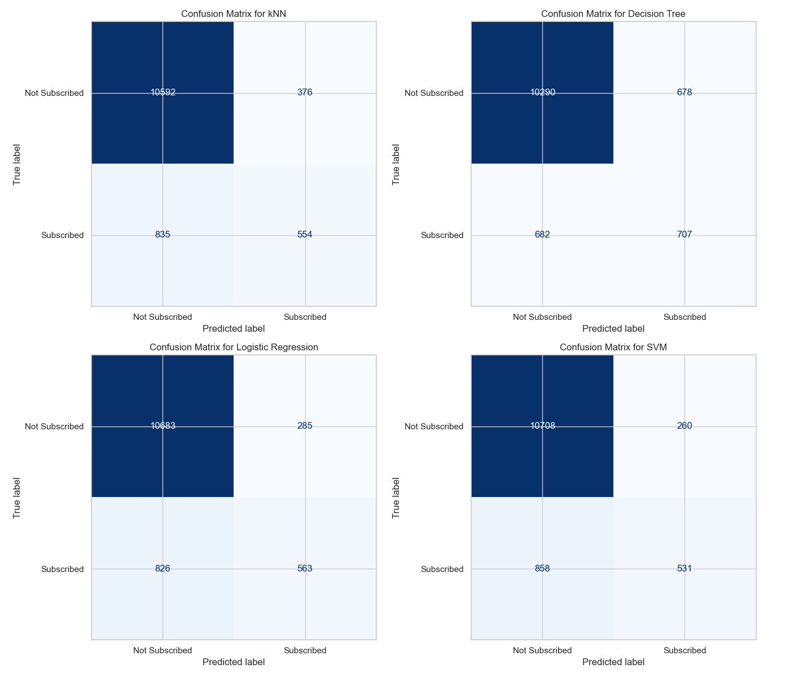

# Bank Marketing Campaigns research

This project involves building and evaluating machine learning models using the Bank Marketing dataset. The goal is to predict whether a client will subscribe to a term deposit based on a variety of features.

## Dataset

The dataset used is the **Bank Marketing** dataset, which contains information on various attributes such as age, job, marital status, education, default status, balance, housing loan, personal loan, and more.

- **Source**: [UCI Machine Learning Repository - Bank Marketing Dataset](https://archive.ics.uci.edu/ml/datasets/Bank+Marketing)

## Project Structure

The project is organized into the following sections:

1. **Data Loading and Exploration**:
    - Load the dataset and explore its structure and contents.
      
  		Client Information:
   
		age: Age of the client<br/>
		job: Job type (categorical)
		marital: Marital status (categorical)
		education: Education level (categorical)
		default: Has credit in default? (categorical)
		housing: Has housing loan? (categorical)
		loan: Has personal loan? (categorical)
	
 		Contact:

		contact: Communication type (categorical)
		month: Last contact month (categorical)
		day_of_week: Last contact day of the week (categorical)
		duration: Last contact duration in seconds (numeric)
	
 		Campaign Information:

		campaign: Number of contacts performed during this campaign (numeric)
		pdays: Number of days since the client was last contacted (numeric)
		previous: Number of contacts before this campaign (numeric)
		poutcome: Outcome of the previous campaign (categorical)

		Other variables:

		emp.var.rate: Employment variation rate (numeric)
		cons.price.idx: Consumer price index (numeric)
		cons.conf.idx: Consumer confidence index (numeric)
		euribor3m: Euribor 3 month rate (numeric)
		nr.employed: Number of employees (numeric)

		Target Variable:

		y: Subscription to a term deposit (binary: 'yes' or 'no')

  
  
  
  
  
  
  
  
  
  
  
  
  
- Identify and handle any missing values.
  * No missing values
- Encode categorical variables.
  * Categorical columns were encoded using Preprocessing Labelencoder.

2. **Feature Engineering**:
    - Transform and select features for model training.
    - Split the data into training and testing sets.

3. **Baseline Model**:
    - Implement a baseline model using `DummyClassifier` with the strategy `"most_frequent"`.
    - Evaluate the baseline model using various metrics like accuracy, precision, recall, and F1 score.

      

4. **Simple Model**:
    - Implement a simple model using Linear Regression
    - Evaluate the simple model using various metrics like accuracy, precision, recall, and F1 score.

      

5. **Modeling**:
    - Train and evaluate multiple classifiers:
        - k-Nearest Neighbors (kNN)
        - Decision Trees
        - Logistic Regression
        - Support Vector Machines (SVM)
    - Compare models based on their performance.

       
  
       

      

6. **Model Visualization**:
    - Visualize decision boundaries for models using 2D projections.
       
    - Plot confusion matrices for each model.
       
    - Visualize ROC curves to compare the models' performance.
       
    - Plot feature importance for models that support it.
       

7. **Findings**:
   
	Baseline Model Evaluation: The baseline model, using a DummyClassifier with the "most_frequent" strategy, was 	implemented to set a minimum benchmark. As expected, the model yielded high accuracy due to the imbalanced nature of the dataset (where the majority class dominates), but it performed poorly on metrics that consider the minority class (like precision, recall, and F1 score). This underscores the importance of evaluating more sophisticated models that can handle class imbalance more effectively.
	
	Feature Engineering and Dimensionality Reduction: Categorical variables were successfully encoded, transforming the data into a suitable format for model training. Additionally, Principal Component Analysis (PCA) was applied to reduce the dataset to two dimensions, primarily for visualization purposes. While PCA is valuable for understanding the dataset's structure and visualizing decision boundaries, the reduced dimensions may lose some information, impacting model interpretability when applied beyond visualization.
	
	Model Performance Comparison: Four classifiers—k-Nearest Neighbors (kNN), Decision Trees, Logistic Regression, and Support Vector Machines (SVM)—were trained and evaluated. 
	
	Logistic Regression: This model achieved a good balance between precision and recall, making it a strong candidate for scenarios where both false positives and false negatives are costly.
	
	SVM: The SVM classifier also performed well, particularly in separating classes with a clear margin, which was evident from the decision boundary visualizations.
	
	Decision Trees: This model offered insights into feature importance and decision-making processes but was prone to overfitting, particularly with complex datasets.
	
	kNN: The kNN classifier provided reasonable accuracy but struggled with high-dimensional data, as its performance was heavily influenced by the choice of neighbors and the curse of dimensionality.
	
	Visualization and Interpretability:
	
	Decision Boundaries: Visualization of decision boundaries, particularly after applying PCA, illustrated how different models separate the classes. While kNN and SVM provided smoother, more defined boundaries, Decision Trees had more complex, jagged boundaries, reflecting their decision-making process.
	
	Confusion Matrices: The confusion matrices for each model highlighted the number of true positives, false positives, true negatives, and false negatives, offering a deeper understanding of each model's strengths and weaknesses.
	
	ROC Curves: ROC curves were used to compare models, with Logistic Regression and SVM showing the highest Area Under the Curve (AUC), indicating their robustness in distinguishing between the positive and negative classes.
	
	Feature Importance: Decision Trees provided a clear view of feature importance, revealing which features played the most critical roles in predicting the target variable. This insight is valuable for domain experts to focus on key attributes that influence customer behavior.
	
	Business Insights:
	The analysis suggests that campaign-related features, such as the number of contacts performed during this campaign (campaign) and the number of days since the client was last contacted from a previous campaign (pdays), are significant predictors of whether a customer will subscribe to a term deposit. Understanding the influence of these features can help in designing more targeted and effective marketing strategies.

9. **Next Steps**:

	Model Refinement and Tuning:
	
	Hyperparameter Tuning: Perform hyperparameter tuning for the Logistic Regression and SVM models using techniques like Grid Search or Randomized Search to identify the optimal settings for parameters such as regularization strength, kernel type (for SVM), and others. This step can further enhance model performance.
	
	Ensemble Methods: Consider testing ensemble methods like Random Forest, Gradient Boosting, or AdaBoost, which may offer improved performance by combining the strengths of multiple models.
	
	Class Imbalance Handling: Implement techniques to address class imbalance, such as SMOTE (Synthetic Minority Over-sampling Technique) or class weighting, which can help in training more balanced models.
	
	Feature Engineering Enhancements:
	Interaction Features: Explore the creation of interaction features, which could capture relationships between variables that are not evident when they are considered independently.
	
	Polynomial Features: For models like Logistic Regression, consider adding polynomial features to capture non-linear relationships within the data.
	
	Feature Selection: Perform feature selection to identify and retain the most informative features, potentially reducing model complexity and improving interpretability.
	
	Advanced Evaluation and Validation:
	
	Cross-Validation: Apply k-fold cross-validation to ensure that model evaluation is robust and not dependent on a single train-test split. This will provide a more reliable estimate of the model’s performance.
	
	Calibration: For models like Logistic Regression, assess whether the probability estimates are well-calibrated, which is crucial for decision-making based on predicted probabilities.
	
	Deployment and Monitoring:
	
	Model Deployment: Once the best-performing model is identified and tuned, consider deploying it in a real-world environment where it can be integrated into the bank’s marketing system to predict customer responses in real-time.
	
	Performance Monitoring: Post-deployment, set up monitoring to track model performance over time. This is essential to detect any degradation in performance, which might necessitate model retraining or updating.
	Strategic Recommendations:
	
	Targeted Marketing Campaigns: Use the insights from feature importance to design more effective marketing campaigns, focusing on key segments of the customer base that are more likely to respond positively to term deposit offers.
	
	Continuous Learning: Establish a feedback loop where the model is regularly updated with new data, ensuring that it adapts to changing customer behaviors and market conditions.
	
	Customer Segmentation: Leverage the model's predictions to segment customers based on their likelihood to subscribe, allowing for more personalized and resource-efficient marketing approaches.
	
 These next steps will not only refine the model but also ensure that the insights gained from the analysis are effectively translated into actionable strategies that can drive business value.
      

## Installation and Usage

To run this notebook, you'll need Python 3.x and the following libraries:

```bash
pip install numpy pandas scikit-learn matplotlib seaborn

