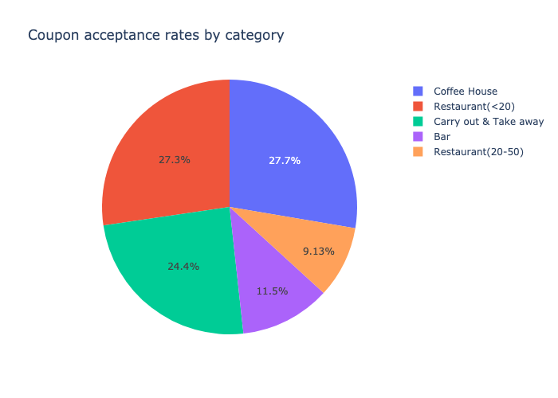
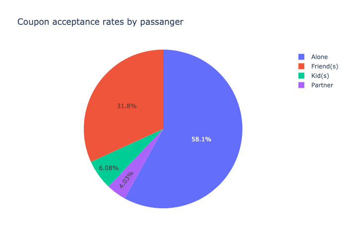
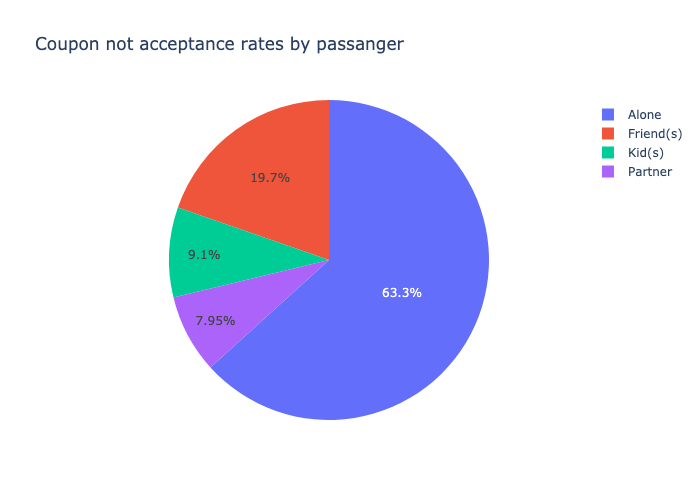
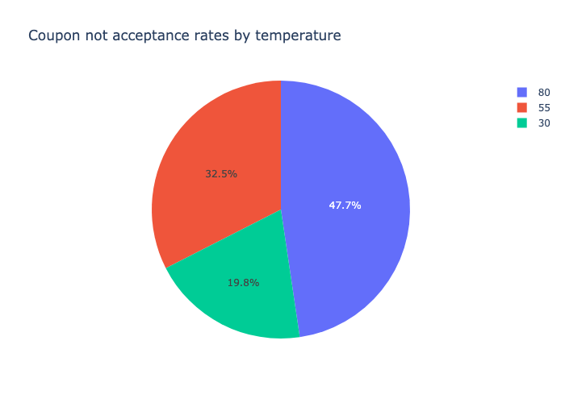
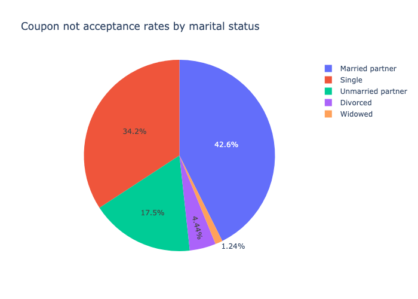

# Will a Customer Accept the Coupon?

**Context**

Imagine driving through town and a coupon is delivered to your cell phone for a restaraunt near where you are driving. Would you accept that coupon and take a short detour to the restaraunt? Would you accept the coupon but use it on a sunbsequent trip? Would you ignore the coupon entirely? What if the coupon was for a bar instead of a restaraunt? What about a coffee house? Would you accept a bar coupon with a minor passenger in the car? What about if it was just you and your partner in the car? Would weather impact the rate of acceptance? What about the time of day?

Obviously, proximity to the business is a factor on whether the coupon is delivered to the driver or not, but what are the factors that determine whether a driver accepts the coupon once it is delivered to them? How would you determine whether a driver is likely to accept a coupon?

**Overview**

The goal of this project is to use what you know about visualizations and probability distributions to distinguish between customers who accepted a driving coupon versus those that did not.

**Data**

This data comes to us from the UCI Machine Learning repository and was collected via a survey on Amazon Mechanical Turk. The survey describes different driving scenarios including the destination, current time, weather, passenger, etc., and then ask the person whether he will accept the coupon if he is the driver. Answers that the user will drive there ‘right away’ or ‘later before the coupon expires’ are labeled as ‘Y = 1’ and answers ‘no, I do not want the coupon’ are labeled as ‘Y = 0’.  There are five different types of coupons -- less expensive restaurants (under $20), coffee houses, carry out & take away, bar, and more expensive restaurants ($20 - $50).

### Data Description
Keep in mind that these values mentioned below are average values.

The attributes of this data set include:
1. User attributes
    -  Gender: male, female
    -  Age: below 21, 21 to 25, 26 to 30, etc.
    -  Marital Status: single, married partner, unmarried partner, or widowed
    -  Number of children: 0, 1, or more than 1
    -  Education: high school, bachelors degree, associates degree, or graduate degree
    -  Occupation: architecture & engineering, business & financial, etc.
    -  Annual income: less than $12500 , $12500 - $24999, $25000 - $37499, etc.
    -  Number of times that he/she goes to a bar: 0, less than 1, 1 to 3, 4 to 8 or greater than 8
    -  Number of times that he/she buys takeaway food: 0, less than 1, 1 to 3, 4 to 8 or greater
       than 8
    -  Number of times that he/she goes to a coffee house: 0, less than 1, 1 to 3, 4 to 8 or
       greater than 8
    -  Number of times that he/she eats at a restaurant with average expense less than $20 per
       person: 0, less than 1, 1 to 3, 4 to 8 or greater than 8
    -  Number of times that he/she goes to a bar: 0, less than 1, 1 to 3, 4 to 8 or greater than 8
   
2. Contextual attributes
    - Driving destination: home, work, or no urgent destination
    - Location of user, coupon and destination: we provide a map to show the geographical
      location of the user, destination, and the venue, and we mark the distance between each
      two places with time of driving. The user can see whether the venue is in the same
      direction as the destination.
    - Weather: sunny, rainy, or snowy
    - Temperature: 30F, 55F, or 80F
    - Time: 10AM, 2PM, or 6PM
    - Passenger: alone, partner, kid(s), or friend(s)

3. Coupon attributes
    - time before it expires: 2 hours or one day

====================================================================

## Outcomes:

#### 1. What proportion of the total observations chose to accept the coupon?

The coupon acceptance rate is `56.84%`.

Coupon acceptance rate by category:

## 2. Bar coupons analysis - 

#### 1. What proportion of bar coupons were accepted?

41.00% of bar coupons were accepted.

#### 2. Hypothesize about drivers who accepted the bar coupons

77% Bar coupons used by the Drivers for more than 3 times a month.
72% Bar coupons used by the drivers under age of 30 for more than once a month.

## 3. Carry out & Take away analysis - 

#### 1. What proportion of Carry-out & Take-away coupons were accepted?

73.55 of Carry-out & Take-away coupons were accepted.

#### 2. Hypothesize about drivers who accepted the carryout coupons

Coupon acceptance rate with partner is higher than any other passengers - 58.1%

## 4. Analysis on the coupon not accepted - 

This analysis will help the marketing strategy to target the drivers based on the contextual attributes listed below.

#### 1. 63.3% of drivers traveling alone not accepted any coupons. Below is the visualization by passanger. 

#### 2. Temperature also plays important role of coupons not accepted by the drivers. 
47.7% of coupons not accepted when the temperature is max of 80. 

#### 3. 42.6% of coupons not accepted when the drivers are traveling with married partners. 

## 5. Target marketing for better outcomes - 

Establish a feedback mechanism to gather insights from drivers who accept or reject coupons, enabling continuous improvement in coupon offerings. Regularly monitor coupon acceptance rates and adjust strategies accordingly. Evaluate the return on investment (ROI) for coupon campaigns to ensure cost-effectiveness.
